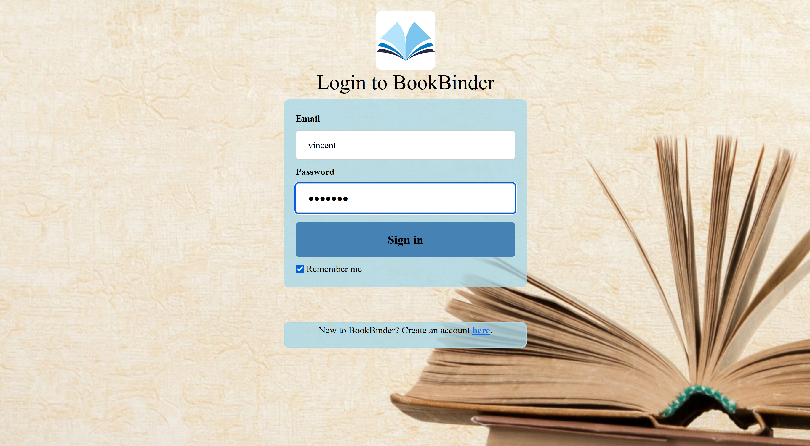
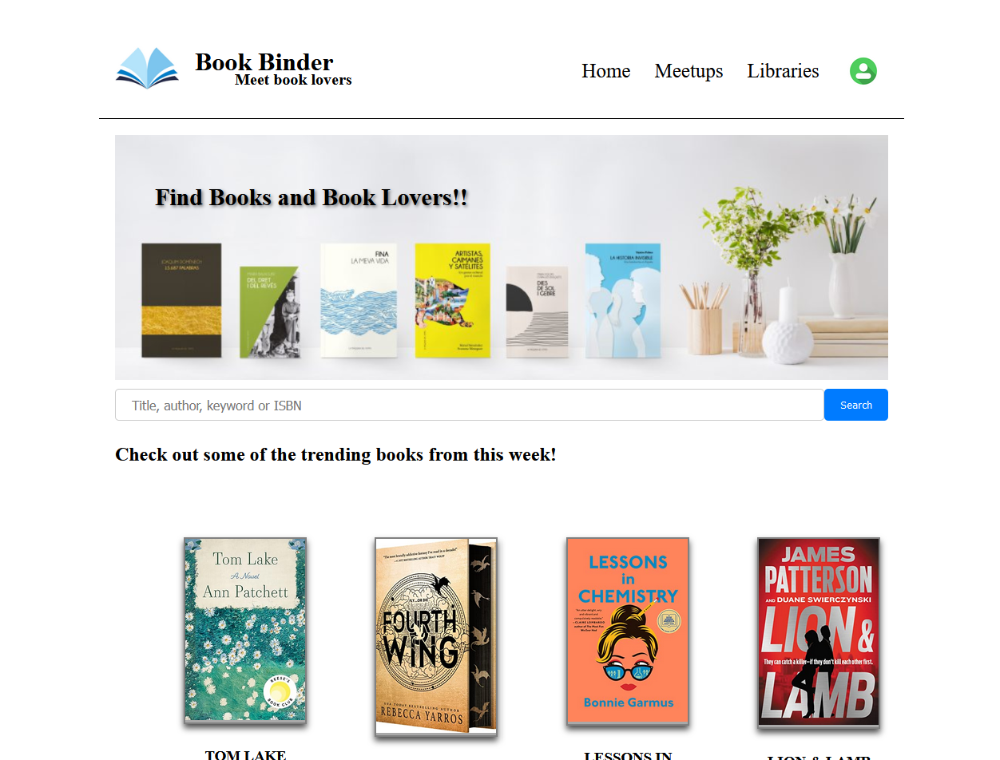
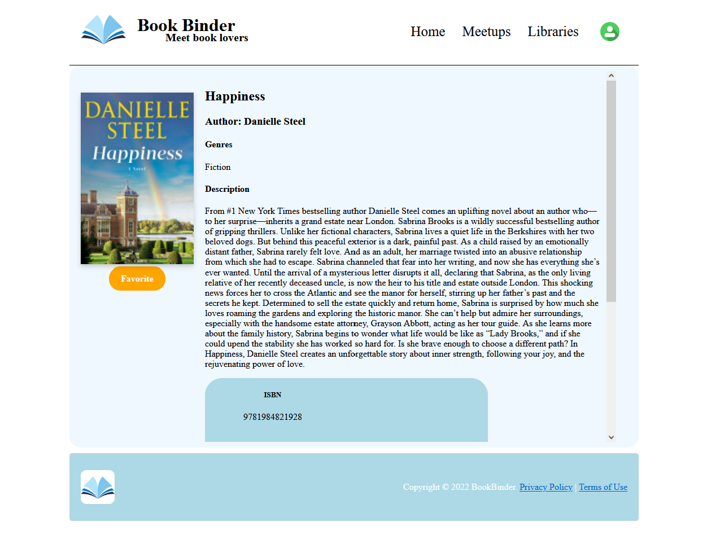
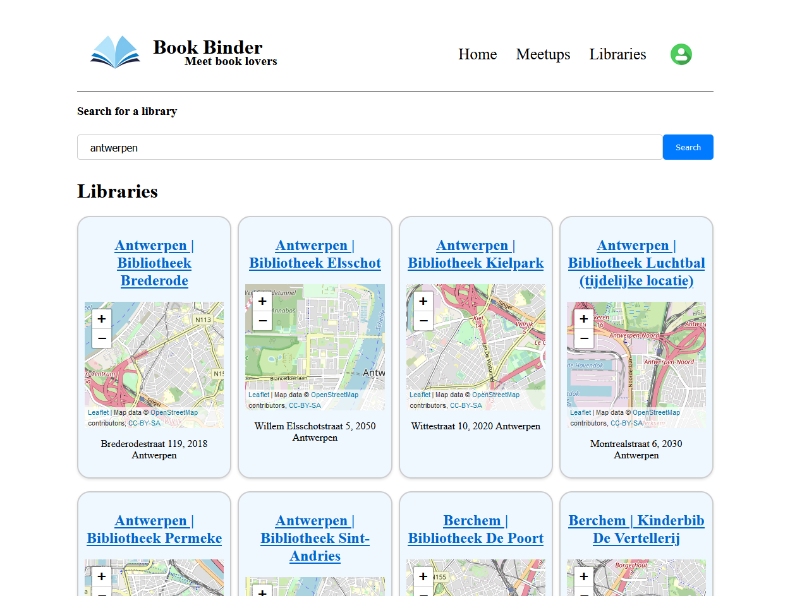
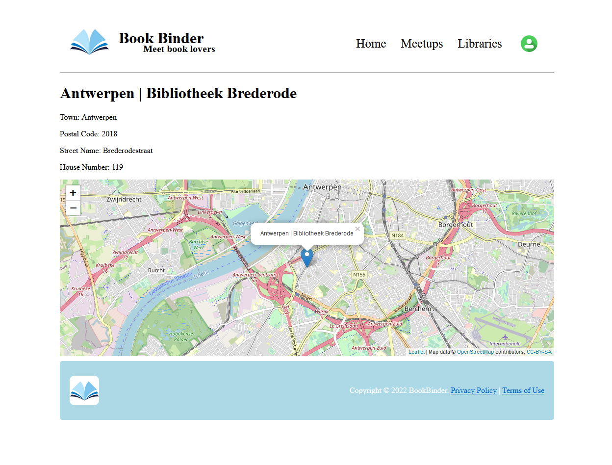
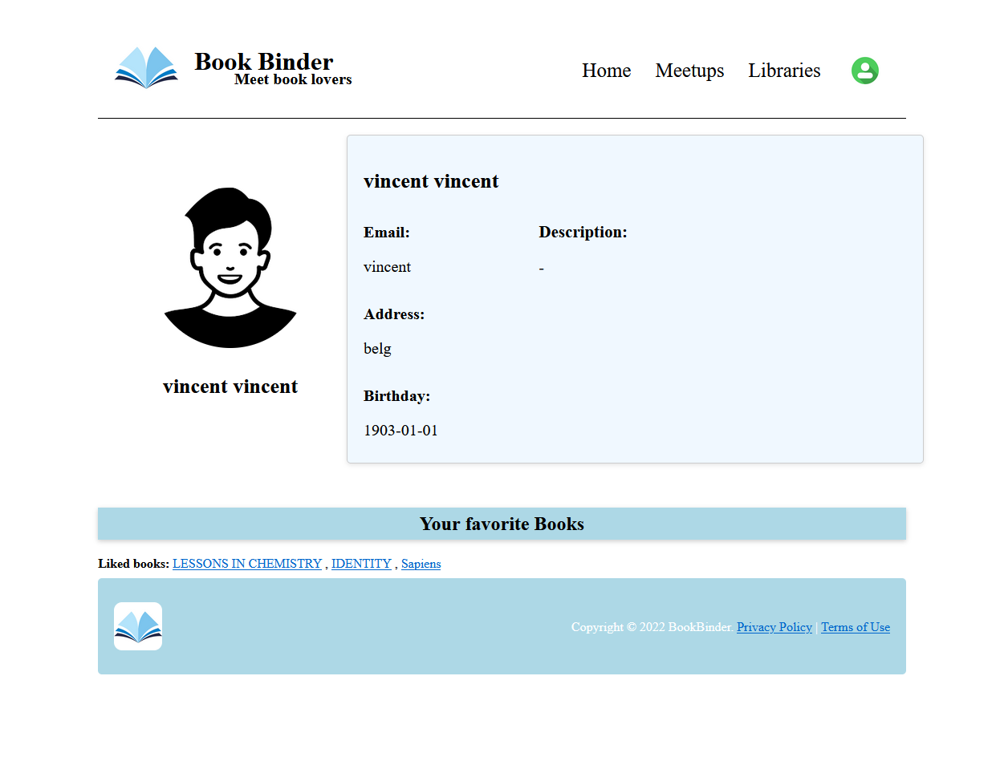
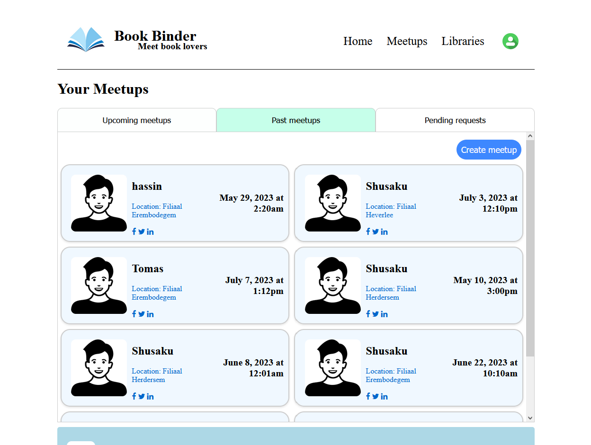
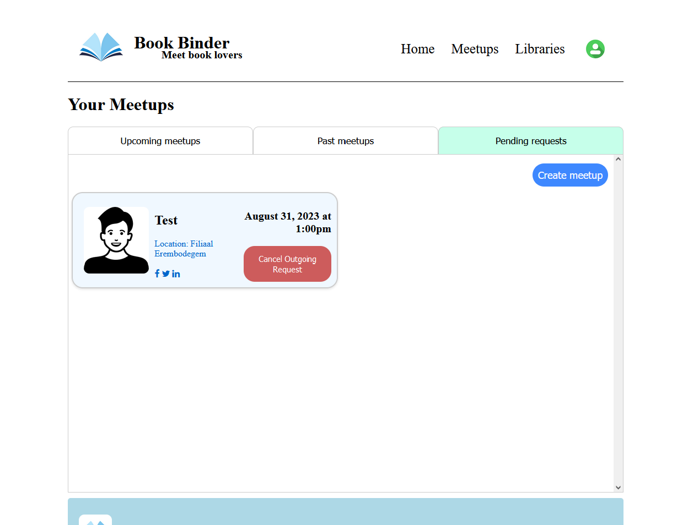

# BookBinder WebApp

## Introduction
BookBinder is a web application tailored for book lovers. It connects individuals with similar reading interests, allowing them to discover books, locate libraries, and organize meetups for engaging discussions.

## Key Features
- **Book Search**: Leverages Google's Books API for a comprehensive book exploration experience.
- **Library Locator**: Integrates data from the Flemish Government website to find local libraries and display them neatly using the openstreetmap API.
- **Meetup Management**: Enables users to plan and join meetups at nearby libraries, fostering community connections among 
readers.

## Technologies
- **Backend**: PHP with Symfony framework, MySQL server.
- **Frontend**: JavaScript, CSS, HTML/Twig.
- **Database**: SQL backend for managing library and meetup data.

## Showcase
Here is a look at the various aspects of the BookBinder web application:

### Login Page

### Home Page

On the home page you can find the current most popular books.

### Book

A more detailed look at a book, this pages shows details about the book itself as well as information about likes and which users liked it.

### Library Search

You can browse any library in the database by location.

### Library

You can look at the library information/map in more detail.

### Profile

Detailed information about a user.

### Meetup Management

This page shows you all the information about current/past/invites concerning meetups. From this page you can also plan a new meetup.
